# Your Pilet Build pipeline

## Required Actions From You

Things you need to do before it will BUILD!!!

- [ ] Create a Jira ticket to get this repo added to Github allowed Runners [example](https://icis-lnrs.atlassian.net/browse/OPT-19222) OR YOU WILL NOT BUILD!
- [ ] Create Token for Deployment: Please see doc [Token](./token.md)

## The build

What you are getting in the build:

- SEM_VER setup
- Unit test run
- Security scans (whitesource, checkmarx, snyk coming soon)
- Build to docker images (authoring/subscriber)
- Local End to end test run (authoring/subscriber)
- Deployment to `env-name` Authoring
- Deployment to `env-name` Subscriber
- E2e test run on `env-name` Authoring
- E2e test run on `env-name` Subscriber

Environments that are supported

- Systest
- Staging
- Integration
- Performance
- Onboarding
- Production

## How to start a deployment

1. 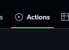
> Go to Actions 
2. 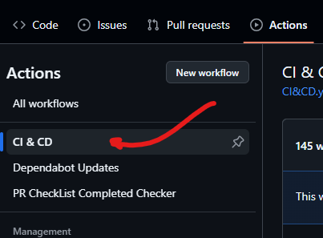
> Find CI&CD
3. 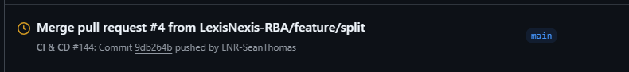
> Select a branch
4. 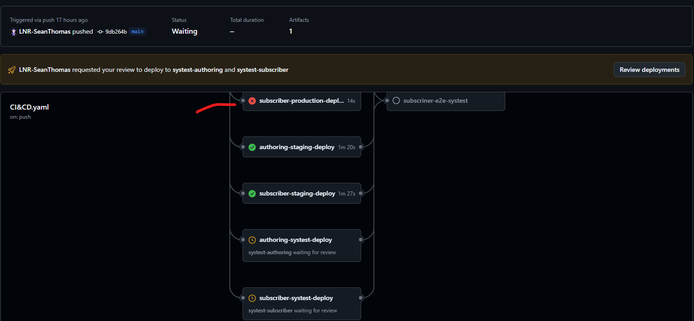
> Check you don't have errors

### Deployment time:

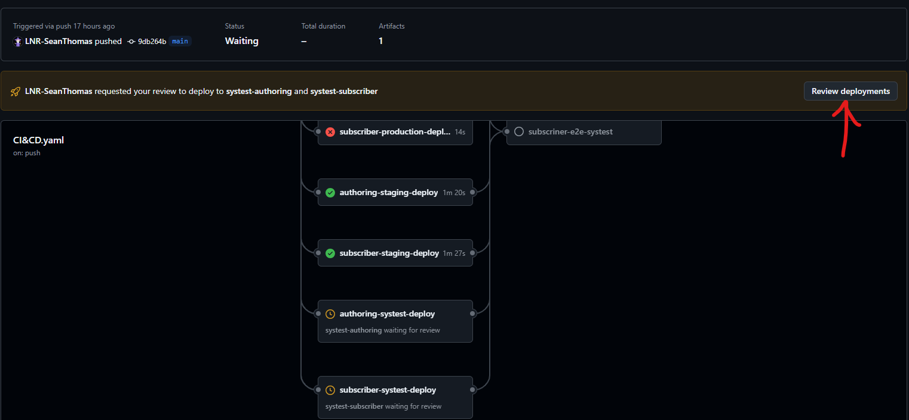
> Click "review deployments"

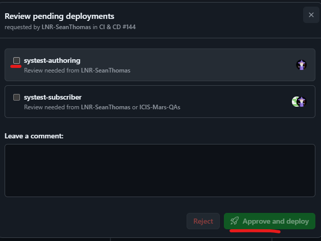
> Select which deployment you want deployed

## How to get production enabled

You have to create a tag first:

1. 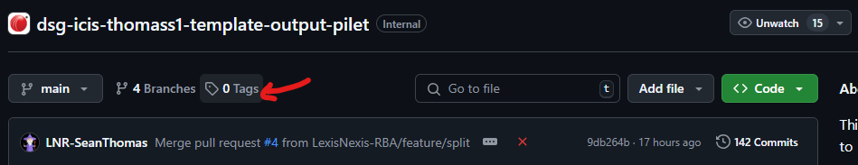
> Select tag
2. 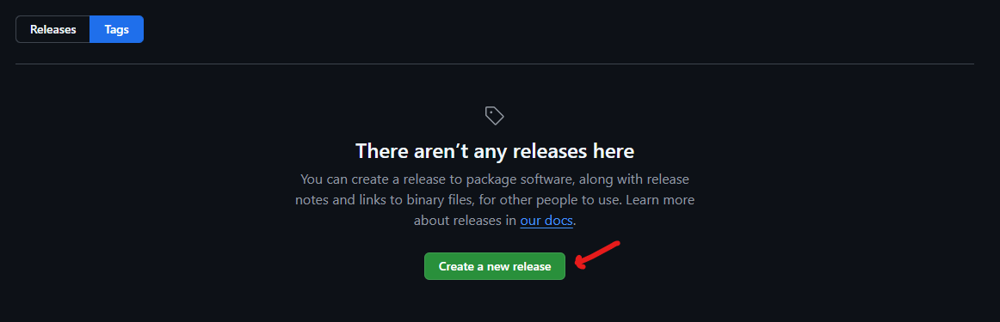
> Create new release
3. 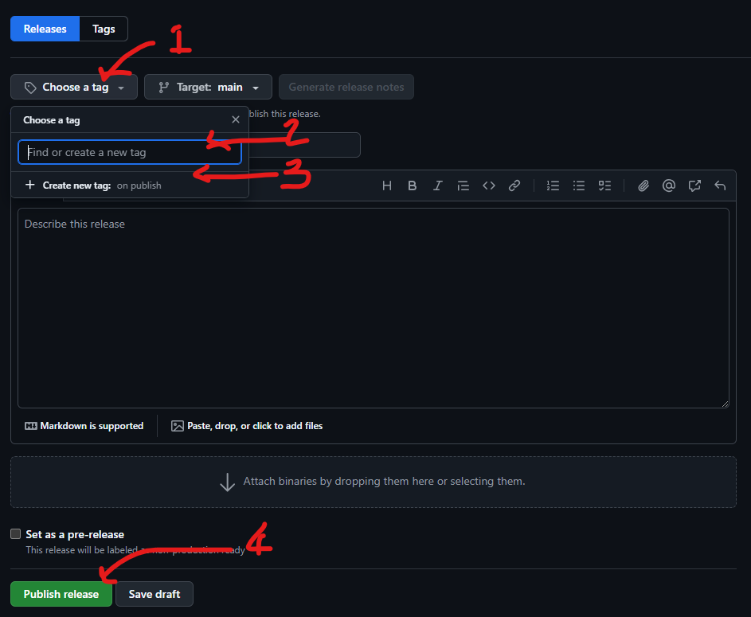
> 1: Choose tag
> 2: Enter in a tag, please follow semantic numbering, if you don't go rewrite the version scripts
> 3: Click "Create new tag"!!!
> 4: Publish release

4. If you go back to actions, you will see the tag has started building, when it is done the production level buttons will enable:
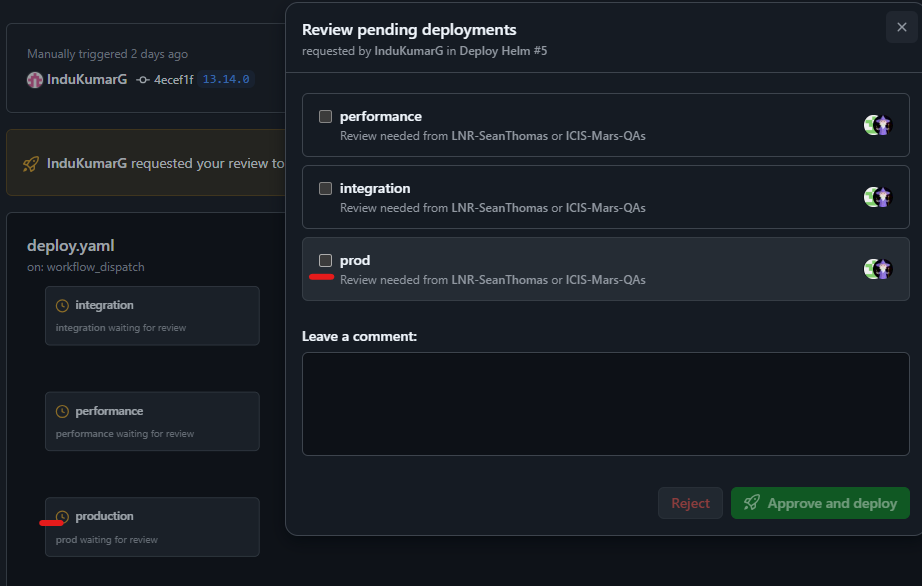

## How deployment works

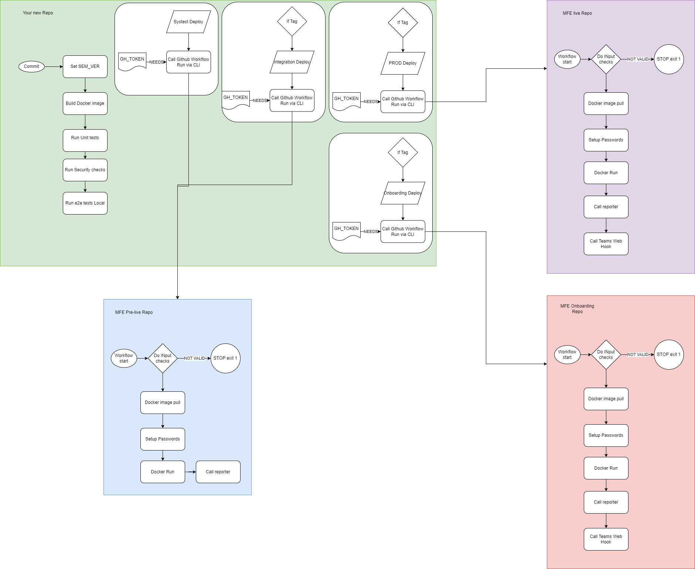

> When you click the approve button, the action will call another repos workflow using your token

> It then does the MFE deployment:

- Get Docker image
- Get passwords
- Run Docker image:
  - Delete current version from server
  - Upload zip to server
- Report on deployment
- If Live: report on teams channel