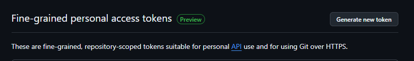
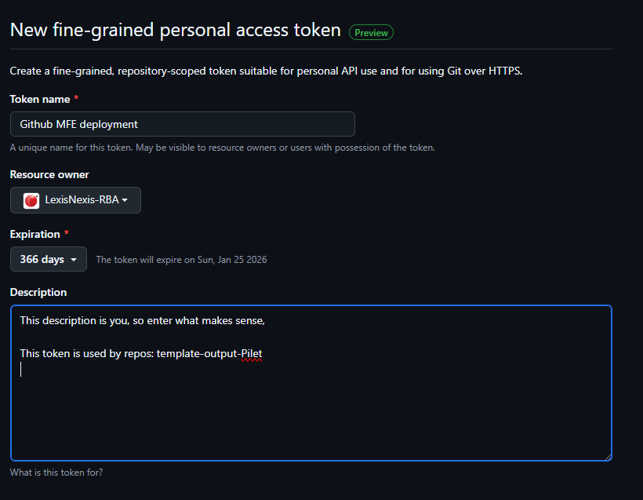
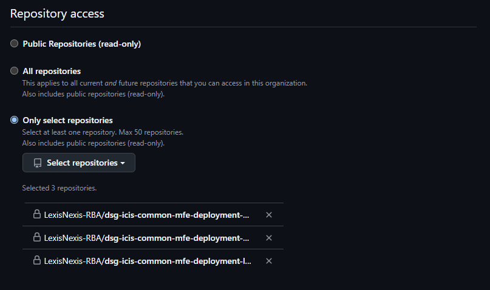
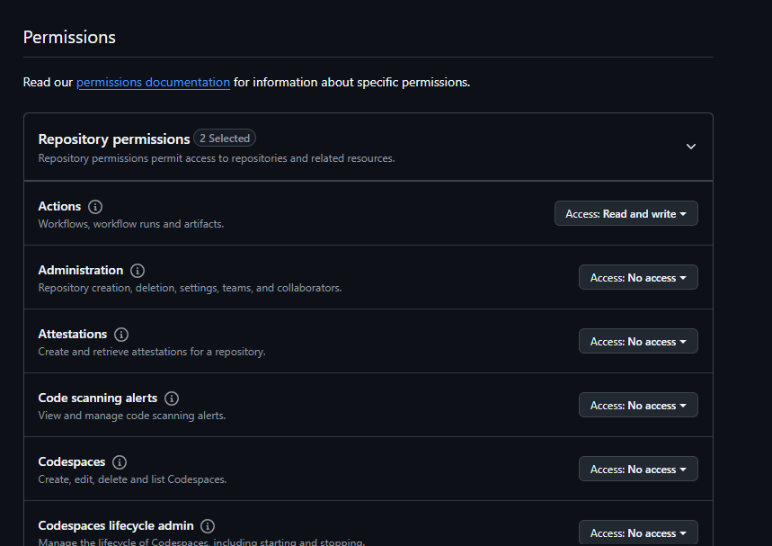
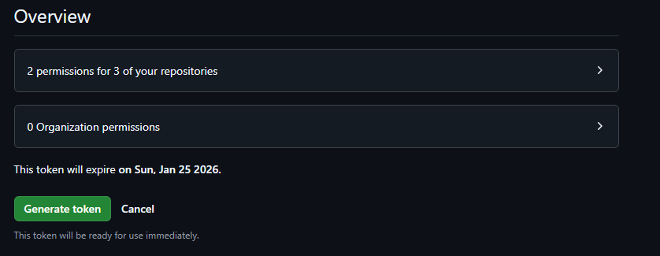
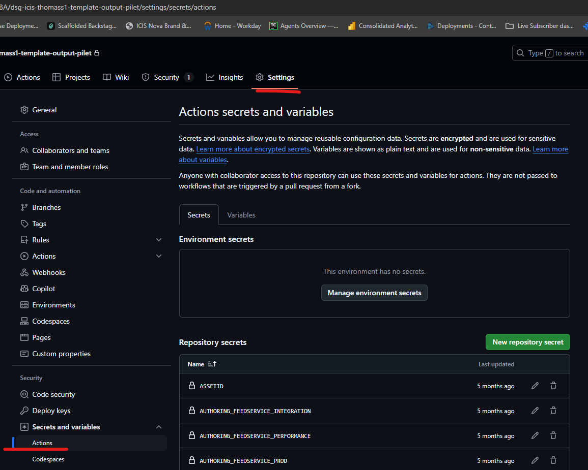
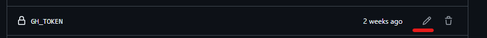
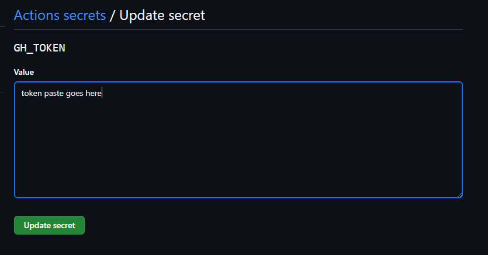

## How to create Token

### Rules:

- The squad will look after who in their team can deploy from their Repo
  - You don't need OPT ticket to add another person to your own deployment
- The squad lead will give a Token!

### Squad lead instructions

- Request access to group: https://github.com/orgs/LexisNexis-RBA/teams/icis-mfe-live-deployers 
  - Ping @Sean, @Sanjev in teams
- Go to: https://github.com/settings/personal-access-tokens
- "Generate new token" 
- 

> - Set a name that you will remember
> - Set Owner to LexisNexis-RBA
> - Set Expiry to 366 days (and put a calendar event to remind yourself)
> - Set a description that will remind you what this is for

- 
> - Set to specific repos
> - ADD THESE REPOS AND NOTHING ELSE!

- dsg-icis-common-mfe-deployment-pre-live
- dsg-icis-common-mfe-deployment-live
- dsg-icis-common-mfe-deployment-onboarding

- 

> Under permissions
> ONLY SET ACTIONS! to read-write

- 
> Click Generate

### You have a token where to put:

Go to your repo settings

Example:

Find the GH_TOKEN var:

Paste your new token 

> NOTE This is not Gitlab you can't view the secrets after adding them